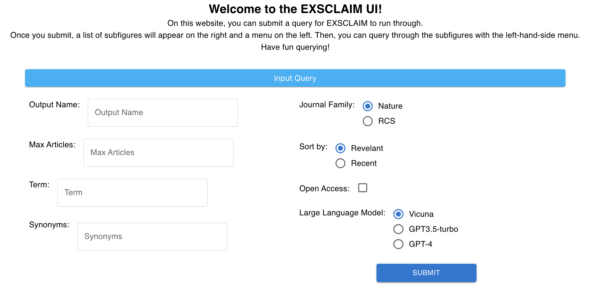
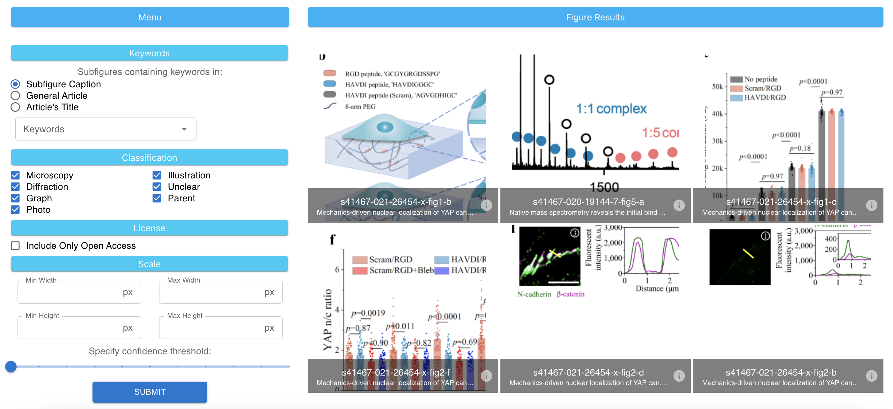

# EXSCLAIM UI

Implements a user interface for viewing results from the [exsclaim](https://github.com/MaterialEyes/exsclaim) pipeline.

## How it Works
Once the UI loads, the user starts at the query page. Here, the user can input their own EXSCLAIM query, which is submitted to the API once they press the Submit button.


After submitting, the UI will load in the subfigure results along with a subfigure menu. In this menu, users can query and filter through the results for what they want. Pressing the "Back to Query" button will send the people back to the original query page.


Right now, the subfigure results page and query page are working on their own. People can filter through the results and the EXSCLAIM inputs are getting added to the API. The goal right now is to get exsclaim running on the users' inputs and returning the results to the subfigures page.


## Installation and Usage

This project is implemented using React for its front-end, Django for its API, and Postgres for its database. Each of these are built in their own Docker containers which are orchestrated using [Docker Compose](https://docs.docker.com/compose/install/). Therefore the prerequisites are Docker and Docker Compose. 

To start the project, in the project root directory: `docker-compose up`. If changes have been made to the API models, you must run: 
```bash
docker-compose run --rm api python manage.py makemigrations exsclaim
docker-compose run --rm api python manage.py migrate
```

You can then navigate to http://localhost:3000 to view the dashboard. Any changes should be reflected once saved. You can explore the API at http://localhost:8000/api/v1/

Data added to the database will persist between runs unless you remove the postgres container. 

## Seeding the database

For development and testing, it is useful to have a small amount of pre-populated data. Since we would like our sample data to be very realistic (images with reasonable croppings), we use a fixture instead of a factory. To load, run:
```bash
docker-compose run --rm api python manage.py loaddata exsclaim_fixture.json
```

## Installing new node packages

If you need a new node package,
```bash
docker exec -it <dashboard_container_name> npm install <package name>
```
This should update `package-lock.json` and `package.json`. Make sure to commit these changes for them to persist. 

## Common Errors

#### API 404 Error
The API requires a trailing slash on its path. 

#### Bind for 0.0.0.0:8000 failed: port is already allocated
The API container might still be running, or you have another service running. If it is an old container, try `docker container ls` and `docker kill <NAME>` to stop it and try again.

#### Dashboard failks with ENOSPC
The dashboard doesn't have enough disk space to run. Try this [stackoverflow](https://stackoverflow.com/questions/22475849/node-js-what-is-enospc-error-and-how-to-solve).